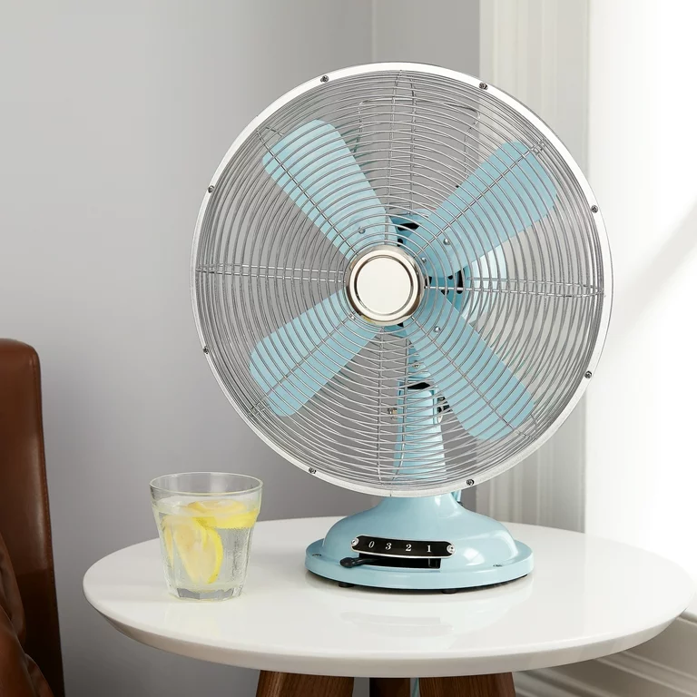
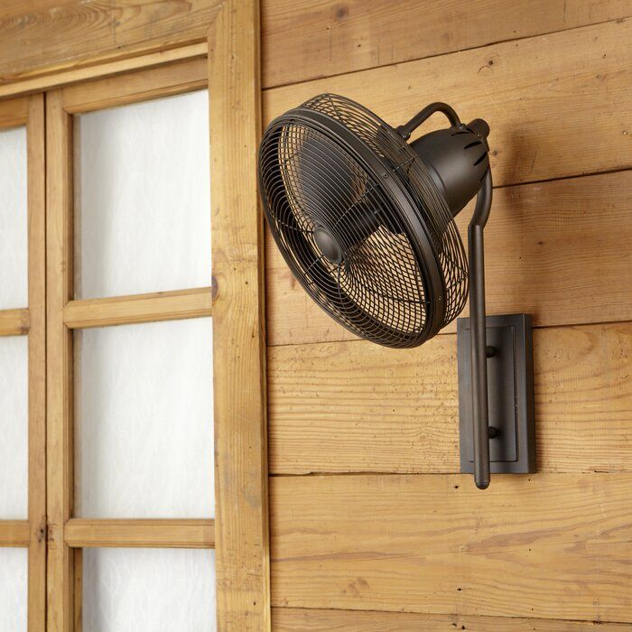
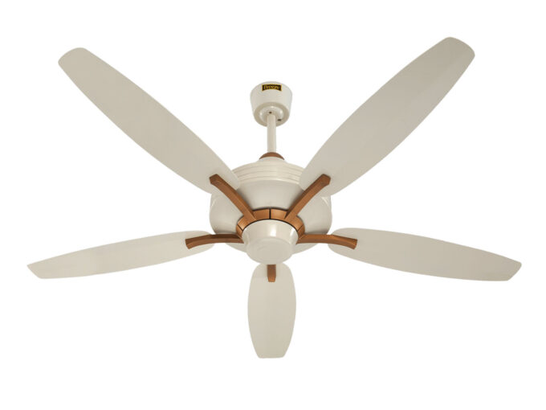

# Fanofan Electric Fans

Fanofan offers a wide range of electric fans, including inverter, remote-controlled, ceiling, table, and exhaust fans. Our fans are designed to provide efficient air circulation, combining advanced technology with stylish designs.

## our catagory 
* Table fan
* ceiling fan
* exhaust fan
* bracket fan
* remote controller fan
* stand fan
*  inverter fan

   ## Overview

Fanofan provides high-quality electric fans suited for diverse needs, from energy-saving inverter fans to remote-controlled convenience. Our product line includes:

- Inverter Fans
- Remote-Controlled Fans
- Ceiling Fans
- Table Fans
- Exhaust Fans

## Features

- Energy-efficient designs
- Advanced remote control functionality
- Powerful air circulation for both small and large spaces
- Durable materials for long-lasting use
- Quiet operation to ensure comfort

### Table fan 

 

### Bracket fan

 

### Ceiling fan

 

### Exhaust fan

 

   

